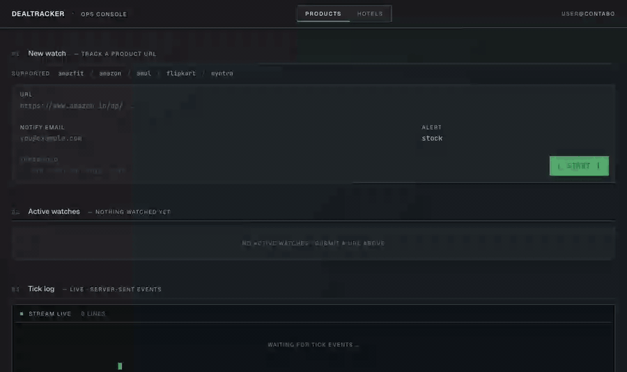
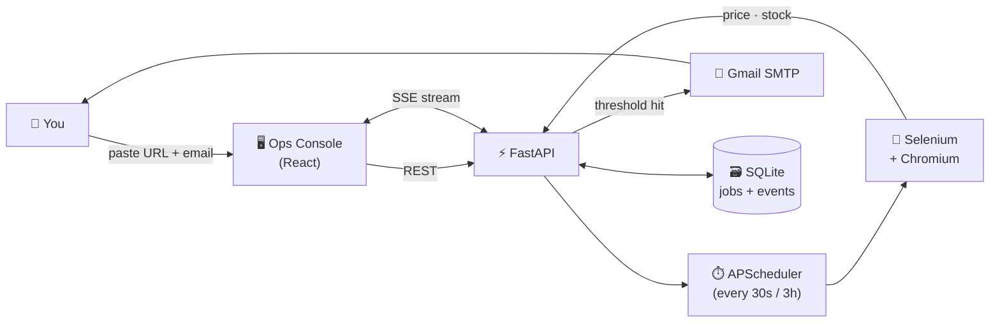
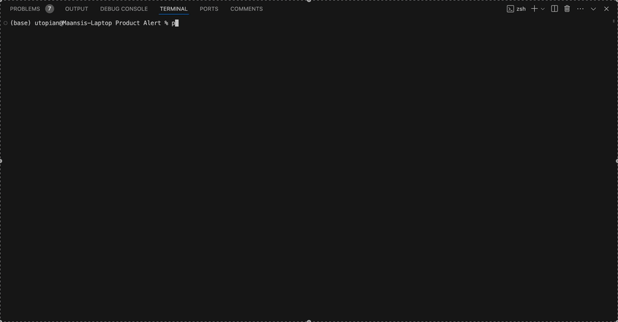

<div align="center">

```
██████╗ ███████╗ █████╗ ██╗     ████████╗██████╗  █████╗  ██████╗██╗  ██╗███████╗██████╗
██╔══██╗██╔════╝██╔══██╗██║     ╚══██╔══╝██╔══██╗██╔══██╗██╔════╝██║ ██╔╝██╔════╝██╔══██╗
██║  ██║█████╗  ███████║██║        ██║   ██████╔╝███████║██║     █████╔╝ █████╗  ██████╔╝
██║  ██║██╔══╝  ██╔══██║██║        ██║   ██╔══██╗██╔══██║██║     ██╔═██╗ ██╔══╝  ██╔══██╗
██████╔╝███████╗██║  ██║███████╗   ██║   ██║  ██║██║  ██║╚██████╗██║  ██╗███████╗██║  ██║
╚═════╝ ╚══════╝╚═╝  ╚═╝╚══════╝   ╚═╝   ╚═╝  ╚═╝╚═╝  ╚═╝ ╚═════╝╚═╝  ╚═╝╚══════╝╚═╝  ╚═╝
```

### **An ops console for the deals you're too lazy to refresh**

📦 **products** · 🏨 **hotels** · 💌 **email** · 🪝 **webhook** · 🤖 **headless Chromium** · 📡 **live ticks via SSE**

[](https://www.python.org)
[](https://fastapi.tiangolo.com)
[](https://react.dev)
[](https://tailwindcss.com)
[](#-quickstart)
[](https://www.selenium.dev)
[](#-tests)

<br/>



<sub>↑ submit a URL · scraper fires within 2 seconds · alert lines flash amber when a threshold hits</sub>

</div>

---

## ✨ What it does

You drop in a URL and an email. DealTracker keeps refreshing the page on
your behalf — every 30 seconds for products, every 3 hours for hotels —
and hits your inbox the moment something good happens.

<table>
<tr>
<td width="33%" valign="top">

### 📦 Stock alerts

Notifies you the **second** an out-of-stock product comes back. No more
hitting refresh on Amul Lassi at 9 AM.

</td>
<td width="33%" valign="top">

### 💸 Price drops

Set a target. We mail you when the price falls below it — across
Amazon, Flipkart, Myntra, Amul, Amazfit.

</td>
<td width="33%" valign="top">

### 🏨 Hotel deals

Drop a Booking/Agoda/MakeMyTrip/Goibibo URL with your check-in dates
baked in — we'll re-scrape that exact stay every 3 hours and email you
when the rate falls below your target.

</td>
</tr>
<tr>
<td valign="top">

### 📡 Live tick stream

A terminal-style pane in the UI streams every scrape attempt, every
result, every alert. Server-Sent Events under the hood.

</td>
<td valign="top">

### 🐳 Single-image deploy

`docker compose up -d` and you're done. Nginx in front for TLS, that's
the whole infra story.

</td>
<td valign="top">

### 🪝 Webhook delivery

Paste any webhook URL — n8n, Zapier, IFTTT, Make.com, Discord, Slack,
or a Telegram bot bridge — and we POST a JSON payload on every alert.
Toggle email and webhook independently per watch.

</td>
</tr>
</table>

---

## 🌐 Supported platforms

<table>
<tr><th align="left">Products</th><th align="left">Hotels</th></tr>
<tr><td>

🛒 Amazon  ·  🛍️ Flipkart  ·  👕 Myntra  ·  🥛 Amul  ·  ⌚ Amazfit

</td><td>

🛏️ Booking.com  ·  ✈️ MakeMyTrip  ·  🏖️ Goibibo  ·  🌏 Agoda

</td></tr>
</table>

The UI hits `GET /api/platforms` on every page load — that endpoint reads
straight from the `SCRAPERS` dict so the strip is always honest.

---

## 🏗️ How it works



One Docker image. One process. One SQLite file. No Redis, no Celery, no
message broker. The persistence is a 36 KB file you can scp.

---

## 🚀 Quickstart

### 🐳 Docker — recommended

The whole stack is one image: Node builds the UI, Python serves the
API, headless Chromium does the scraping.

```bash
git clone https://github.com/MaansiBisht/DealTracker.git
cd DealTracker
cp .env.example .env       # fill in real values, see Configuration ↓
docker compose up -d --build
docker compose logs -f app
```

Open `http://<host>:8000`. Behind nginx/Caddy, reverse-proxy `/` and
`/api/*` to port 8000 and you've got TLS + a domain.

Update later:
```bash
git pull && docker compose up -d --build
```

### ⚡ Local dev

Two processes — `uvicorn` (API on :8000) and `vite` (HMR UI on :5173).

```bash
# 1. Python backend
python -m venv .venv && source .venv/bin/activate
pip install -r requirements.txt
cp .env.example .env
uvicorn src.server.main:app --reload --port 8000

# 2. React frontend (separate terminal)
cd ui && npm ci && npm run dev
```

Open `http://localhost:5173`. Vite proxies `/api` and `/events` to uvicorn.

### 🖥️ CLI

Interactive prompt-driven flow — same scrapers as the web app, no
server, no scheduler. Good for one-off checks from a laptop.

```bash
pip install -r requirements.txt
cp .env.example .env
python main.py        # interactive prompts
```

<details>
<summary>CLI demo</summary>



</details>

---

## 🎛️ Configuration

Every knob is an env var. Real defaults live in `.env.example`.

| Variable                   | Required | What it does                                              |
| -------------------------- | :------: | --------------------------------------------------------- |
| `EMAIL_ADDRESS`            |    ✅    | Gmail account that sends the alerts                       |
| `EMAIL_PASSWORD`           |    ✅    | **Gmail App Password** ([generate here][app-pw])           |
| `PINCODE`                  |    ✅    | Used by Amul scraper before reading stock/price           |
| `SESSION_SECRET`           |    ✅    | Signs the auth cookie. 32+ random bytes (see below).      |
| `APP_BASE_URL`             |    ✅    | Public URL used in magic-link emails & cookie Secure flag |
| `ADMIN_EMAIL`              |    ⏤    | Email that auto-receives admin (sees everyone's watches)  |
| `FALLBACK_EMAIL`           |    ⏤    | Retried when delivery to the watch's email fails          |
| `TICK_INTERVAL_PRODUCT_SEC`|    ⏤    | Default `30` (dev). Use `3600` in prod.                   |
| `TICK_INTERVAL_HOTEL_SEC`  |    ⏤    | Default `60` (dev). Use `10800` in prod.                  |
| `DATABASE_URL`             |    ⏤    | Default `sqlite:////app/data/dealtracker.db`              |
| `LOG_LEVEL`                |    ⏤    | `DEBUG` / `INFO` / `WARNING` for the operator log         |
| `CHROME_BIN`               |    ⏤    | Chromium path. The Docker image sets this for you.        |
| `CHROMEDRIVER_PATH`        |    ⏤    | chromedriver path. Same — Docker handles it.              |

[app-pw]: https://myaccount.google.com/apppasswords

> 🔐 **Why an App Password?** Google blocks plain SMTP login from your
> account password since 2022. Two-factor authentication + an App
> Password is the official path. It's also revocable from one screen.

### 🔑 Auth & sessions

The ops console signs users in via a **one-time magic link** emailed
through the same SMTP setup. No passwords, no reset flow. (The previous
`WEB_USER` / `WEB_PASS` HTTP Basic gate has been removed.)

Set these on first deploy:

```bash
# 32+ random bytes; keep one per environment.
python -c 'import secrets; print(secrets.token_urlsafe(32))'  # → SESSION_SECRET

# Public URL — used both in the magic-link email body AND to flip the
# session cookie's Secure flag (https → Secure-only).
APP_BASE_URL=https://your-domain.example.com

# The single email that auto-receives admin status on sign-in. Admin
# sees every user's watches and tick events, and can stop any job.
# Leave empty for a flat, all-equal-users deployment.
ADMIN_EMAIL=you@example.com
```

On first sign-in the admin claims every legacy watch (those created
before this auth landed). Everyone else starts with an empty workspace
and only sees the watches + tick events they own.

### 🪝 Webhook payload

When a watch alerts, the server POSTs the following JSON body to
your webhook URL. `Content-Type: application/json`, 8s timeout,
no auth header — bring your own auth via the URL path or query if
your bridge needs it.

```json
{
  "type": "dealtracker.alert",
  "ts": "2026-05-10T13:30:09.876+00:00",
  "reason": "price ₹156.00 ≤ threshold ₹1,000.00",
  "job": {
    "id": "e185e0a09a604d5ea5f186975ead997e",
    "kind": "product",
    "platform": "amazon",
    "url": "https://www.amazon.in/dp/B08BPQ9CZ1",
    "alert_type": "price",
    "threshold": 1000,
    "last_status": "in stock",
    "last_price": "₹156.00"
  }
}
```

Common bridges:
- **Telegram**: spin up a bot via [@BotFather], expose its
  `/sendMessage` via an n8n / Make.com / Pipedream webhook, paste that
  URL here.
- **Discord / Slack**: their incoming webhook URLs work directly if
  you wrap the payload through a small bridge that maps `reason` →
  `content`/`text`.
- **Custom**: any HTTPS endpoint that accepts a JSON POST.

[@BotFather]: https://t.me/BotFather

---

## 🧱 Project structure

```
DealTracker/
├── 🐍 main.py                  # CLI entry
├── src/
│   ├── cli.py                 # CLI prompts
│   ├── config.py              # env loader
│   ├── 🕸️  scrapers/           # one file per site (products and hotels share the contract)
│   ├── 🛠️  utils/              # Selenium driver, Gmail SMTP
│   └── 🚀 server/              # FastAPI ops console
│       ├── main.py            # uvicorn entrypoint, lifespan
│       ├── routes.py          # /api/jobs · /api/events/* · /api/platforms
│       ├── runner.py          # one-shot scrape, called per tick
│       ├── scheduler.py       # APScheduler — single-thread, Selenium-safe
│       ├── events.py          # in-process pub/sub for SSE
│       ├── auth.py            # HTTP Basic dependency
│       └── db.py · models.py · schemas.py
├── 🎨 ui/                      # React 19 + Vite + Tailwind v4 + Framer Motion
├── 🧪 tests/                   # pytest — pure unit + TestClient (57 tests, <1s)
├── 💾 data/                    # SQLite, mounted as Docker volume
├── 🐳 Dockerfile               # multi-stage: node builds UI, python serves
├── docker-compose.yml
└── .env.example
```

---

## 🛠️ Add a new scraper

It's three steps. The codebase already has 9 examples to copy from.

<details>
<summary><b>📦 Product scraper</b></summary>

1. Create `src/scrapers/newsite.py`:
   ```python
   def scrape_newsite(driver, url):
       driver.get(url)
       # ...your parsing logic...
       return {
           "title": "Optional product name",
           "price": "1234.56",
           "stock_status": "in stock",   # or "out of stock"
       }
   ```

2. Wire it in `src/scrapers/__init__.py`:
   ```python
   from .newsite import scrape_newsite
   SCRAPERS = {..., "newsite": scrape_newsite}
   PLATFORM_PATTERNS = {..., "newsite.com": "newsite"}
   ```

3. Lock the routing in `tests/test_routing.py` so a typo doesn't unship it later.

</details>

<details>
<summary><b>🏨 Hotel scraper</b></summary>

Same shape, plus append `"newhotel"` to `HOTEL_PLATFORMS`. The user
passes a URL with check-in/check-out dates already in the query string;
your scraper just reads the price for that one date pair. Returned
dict can add `"type": "hotel"` and `"rating"` if available.

</details>

---

## 🧪 Tests

Fast feedback loop — no Selenium, no real network, all under a second:

```bash
pytest -q
```

```
.........................................................                [100%]
57 passed in 0.40s
```

The suite covers:

- 🎯 URL → platform routing (parametrized over every supported site)
- 🔢 price parsing (`₹156.00`, `Rs. 1,299`, bare numbers, junk)
- 📜 Pydantic validation (URL shape, email, alert type, threshold rules)
- 🔌 FastAPI happy paths via `TestClient` (CRUD + recent events JOIN)
- 📡 the SSE event bus (publish, subscribe, drop-oldest backpressure)

Browser-driven scrapes are excluded on purpose — they need a live page.
For end-to-end against a real site, run the `docker compose` stack and
submit a job through the UI.

---

## 🧰 Tech stack

<div>

| Layer       | Choices                                                         |
| ----------- | --------------------------------------------------------------- |
| 🐍 Backend  | Python 3.11 · FastAPI · SQLAlchemy 2.x · Pydantic v2 · APScheduler |
| 🤖 Scrape   | Selenium 4 · BeautifulSoup4 · headless Chromium                 |
| 🎨 Frontend | React 19 · Vite · Tailwind v4 (`@theme`) · Framer Motion        |
| 🔤 Type     | JetBrains Mono Variable · Geist Variable (self-hosted)          |
| 💾 Data     | SQLite (one file)                                               |
| 📡 Realtime | Server-Sent Events (`text/event-stream`)                        |
| 📦 Deploy   | Docker · docker-compose · Nginx/Caddy reverse proxy             |

</div>

---

## 🤝 Contributing

PRs welcome. The fast loop:

```bash
pytest -q && cd ui && npm run build
```

If you change the JSON contract, update both `src/server/schemas.py`
and `ui/src/types/job.ts` so TypeScript catches drift.

---

## 📜 License

Personal / educational use. Respect each site's terms of service —
hammer responsibly.

<div align="center">

<sub>built with ❤️ + a lot of refresh-key fatigue</sub>

</div>
